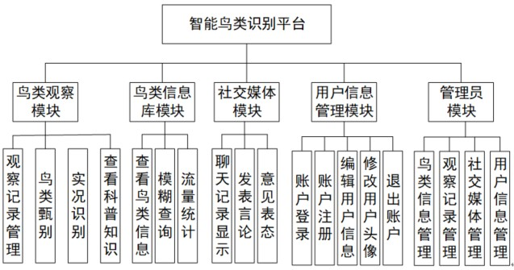
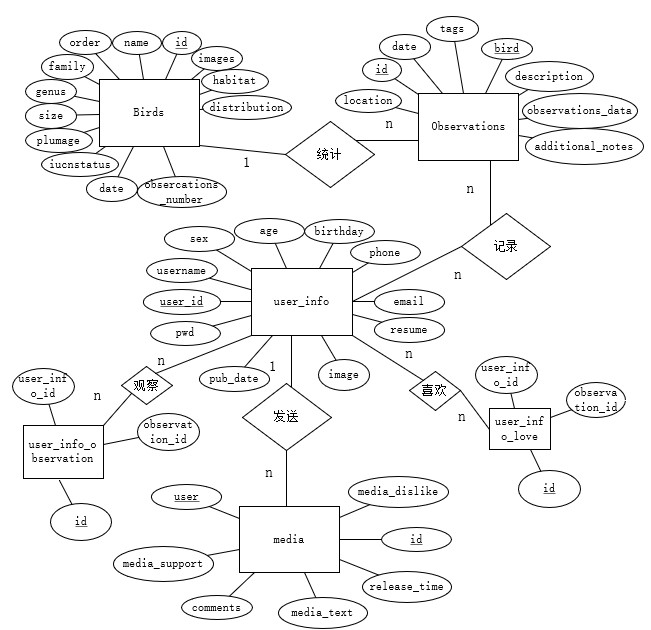
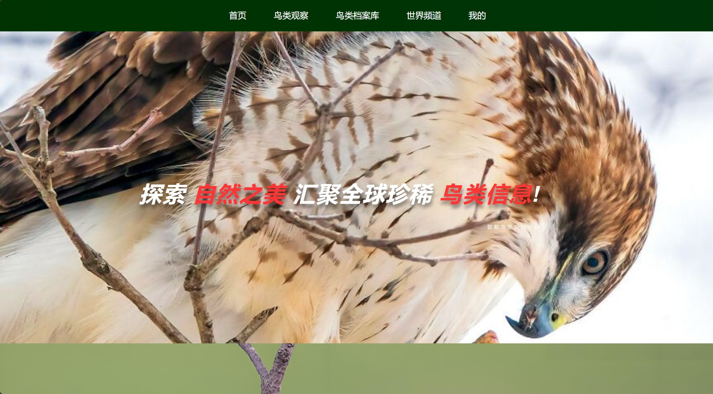
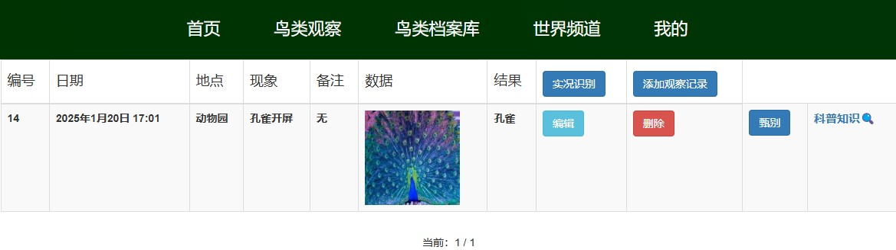
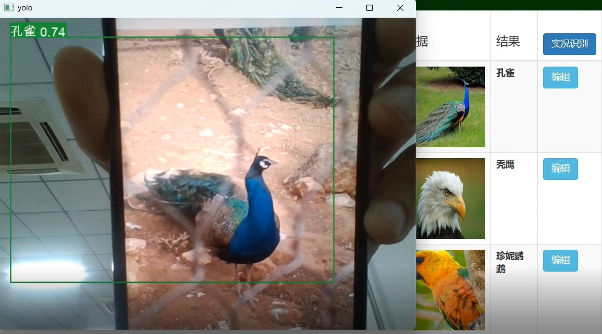
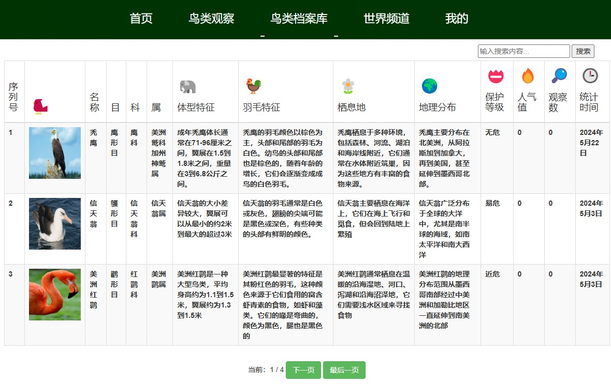
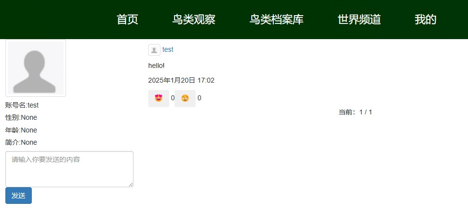
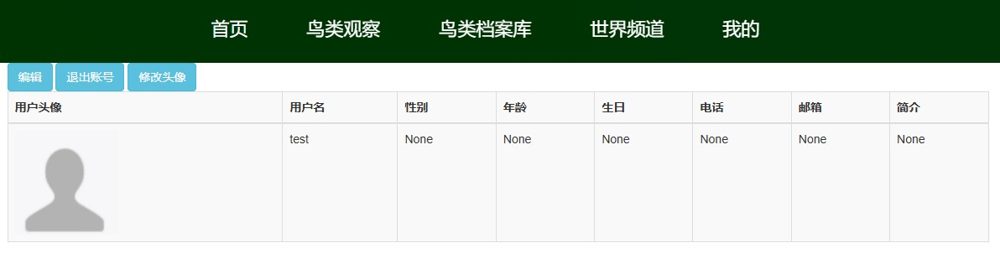
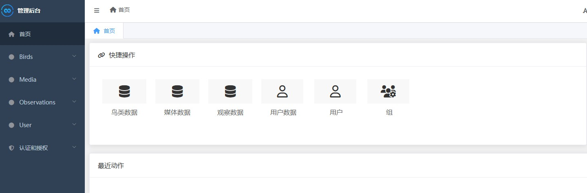

# 基于Django+Yolov8+Tensorflow的智能鸟类识别平台
### 1  项目简介
- 系统旨在为了帮助鸟类爱好者、学者、动物保护协会等群体更好的了解和保护鸟类动物。用户群体可以通过平台采集野外鸟类的保护动物照片和视频，甄别分类、实况分析鸟类保护动物，与全世界各地的用户，沟通交流。
### 2  启动步骤
```python
1.配置开发环境
2.python manage.py makemigrations 数据迁移，控制台运行该命令
3.python manage.py migrate 创建表，控制台运行该命令
4.将SQL文件中的数据导入到MySQL中，数据库名：db_bird
5.python manage.py runserver 启动服务，控制台运行该命令
6.登录个人账号:test,123456
7.登录后台管理系统，管理员账号和密码：admin,123456
```
### 3  开发环境和技术
```python
MySQL	8.0.29
opencv-python	4.9.0
TensorFlow	2.10.0
Ultralytics	8.2.8
Django	3.2.9
Python	3.9.0
NVIDIA GeForce RTX 3050
CUDA Version	12.3
CUDNN	8.2.1
Conda	22.9.0
```
### 4  功能模块



### 5  E-R图

### 6  数据库设计

- observations

  >- **id**：观察记录的唯一标识符（主键）。
  >- **date**：观察发生的日期。
  >- **location**：观察发生的地理位置。
  >- **description**：对观察到的现象的描述。
  >- **additional_notes**：观察者可能添加的其他相关信息或备注。
  >- **observation_data**：存储观察时拍摄的图片的路径或链接。
  >- **tags**：分类标签
  >- **love**: 喜欢
  >- **bird_id**：外键，关联到`Birds`表中特定鸟类的id。
  >- **user**:外键，关联account表中的user_id
  
- birds

  > - **id**：唯一标识每一种鸟类的数字或字符串标识符（主键）。
  > - **images**：存储鸟类图片的路径或链接。
  > - **name**：鸟类的通用名称。
  > -  **order**：鸟类所属的目。
  > -  **family**：鸟类所属的科。
  > -  **genus**：鸟类所属的属。
  > -  **size**：鸟类的体型描述，如长度、翼展、重量等。
  > -  **plumage**：羽毛的颜色和图案。
  > -  **habitat**：鸟类的栖息地，如森林、湿地、草原等。
  > -  **distribution**：鸟类的地理分布范围。
  > -  **iucn_status**：根据IUCN（国际自然保护联盟）的评估，鸟类的保护等级。
  > -  **love_number**:人气值
  > -  **observations_number**:观察数
  > -  **date**:统计时间
  
- user_info_love

  >- **id**:编号
  >
  >- **user_info_id**：用户表编号
  >
  >- **observation_id**：观察表编号
  >
  
- user_info_observation

   >- **id**:编号
  >
  >- **user_info_id**：用户表编号
  >
  >- **observation_id**：观察表编号
  >
  
- media

  >- **media_id**：社交媒体内容的编号
  >- **user**：外键，关联account表中的user_id
  >- **username**：用户名
  >- **text**：发布的内容
  >- **date**：发布的时间
  >- **comments**：评论内容
  
- user_info

  >- **user_id**：用户ID
  >- **username**：用户姓名
  >- **pwd**：用户密码
  >- **user**：外键，关联account表中的user_id
  >- **username**:账号名
  >- **phone**:电话号
  >- **email**：邮箱
  >- ...


### 7  页面设计

- 首页:

- 鸟类观察：

- 实况甄别：

- 鸟类档案馆： 

-  世界频道： 

- 个人信息： 

- 后台管理： 

### 8 后续内容
- 后续内容，请关注我的CSDN账号：https://blog.csdn.net/m0_64027967


